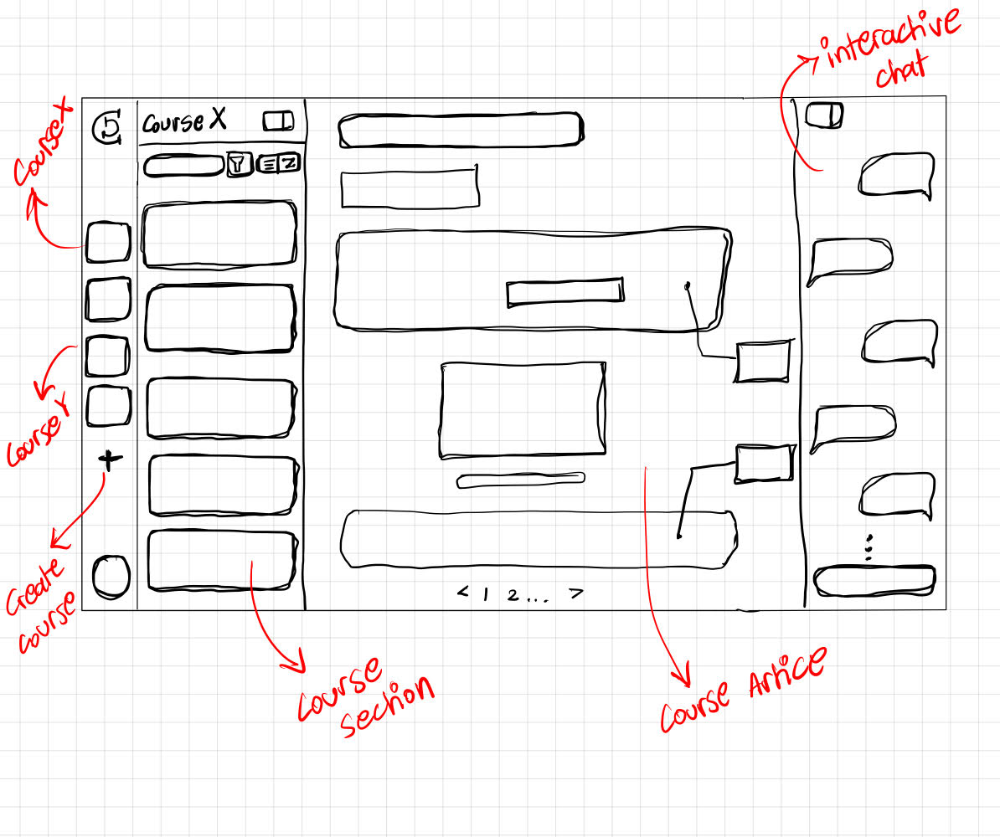

# Project Context: CleverCourse MVP

## 1. Core Concept
An AI-powered educational platform that generates structured, "human-centric" courses. The goal is to solve the barrier to entry for learning by creating personalized, iterative learning paths.

## 2. Technical Stack
- **Framework:** Next.js 15 (App Router)
- **Language:** TypeScript
- **AI SDK:** `@google/generative-ai` (Gemini 2.0 Flash)
- **UI:**
- **Styling:** Tailwind CSS
- **Icons:** Lucide React
- **Package Manager:** pnpm

## 3. Data Structure & Schema
Every course is generated **one section at a time** (stateless to stateful via context injection). Each section follows this strict JSON structure:

### Section Schema:
- **sectionTitle**: (string)
- **article**: 
  - `pages`: Array of 3 objects { `pageTitle`: string, `content`: markdown_string }
- **studyMaterial**: 
  - `mindMap`: Array of 8 strings (concepts)
  - `flashcards`: Array of 5 objects { `front`: string, `back`: string }
- **quiz**:
  - `mcqs`: Array of 5 objects { `question`: string, `options`: string[], `answer`: string }
  - `trueFalse`: Array of 5 objects { `question`: string, `answer`: boolean, `explanation`: string }
  - `fillUps`: Array of 5 objects { `sentence`: string, `missingWord`: string }

## 4. Feature Set (MVP ONLY)
- **Course Setup:** User inputs: Topic, Level, Goal, Tone, and Section Count.
- **Iterative Generation:** - Generate Section N.
  - Store Section N in local state/DB.
  - Generate Section N+1 by passing previous section titles as `previousContext`.
- **Content Rendering:** - Article pages rendered from Markdown.
  - Interactive Quiz components for MCQs, T/F, and Fill-ups.
  - Flashcard flip components and a visual list for the Mind Map.

## 5. File Architecture
- `src/lib/gemini.ts`: Contains the `generateCourseSection` Server Action and the `Schema`.
- `app/course/[id]/page.tsx`: The main viewer for the generated content.
- `components/quiz/`: Individual components for MCQ, TrueFalse, and FillUps.
- `components/study/`: Components for Flashcards and MindMap.
- `.env.local`: Contains `GEMINI_API_KEY`.

## 6. Coding Guidelines for Copilot
- **Security:** Use 'use server' for all AI generation logic.
- **State:** Use React `useState` or `useActionState` for handling the current active section.
- **UI:** Use Tailwind CSS for a modern, minimalist look.
- **Formatting:** Article content must be handled as Markdown (use `react-markdown`).

## 7. Design Layout
